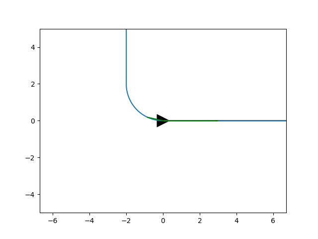
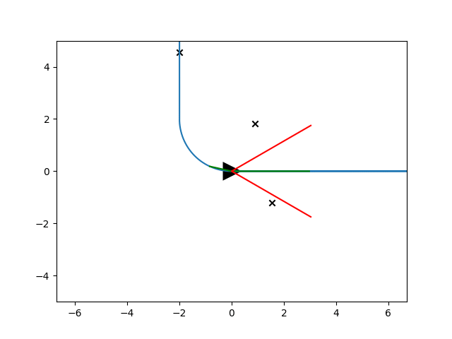
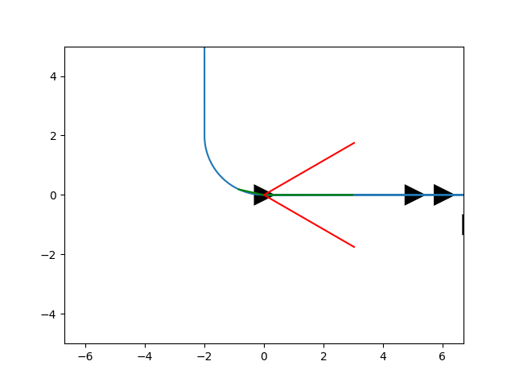

# Optimal Trajectory Generation in the Duckietown Environment

## Introduction 
The goal of the project is to implement  trajectory generation scheme, the approach  consists  in  reducing  the search   space   by   considering   the   optimization   of   specific   cost   functions   which   yield   polynomial trajectories, coupled with a feedforward control , to navigate in the Duckietown environment, which consists in a simulator providing customizable city-like scenarios with lanes and intersections. In this setting, the vehicle is controlled using information provided by the monocular camera on top of the vehicle, which is responsible for recognizing the center lane which defines  the  local  Frenet  frame.  The  simulations  are in  the  Duckietown  simulator (based  on  OpenAI  Gym)  using  Python.

## Table of Contents

* [Installation](#Installation)

* [Simulator Environment Python](#Simulator-Environment-Python)

* [Duckietown](#Duckietown-setup)

* [Run Duckietown](#Run-Duckietown)

## Installation

```
conda create -n gym-duckietown python=3.8.5
conda activate gym-duckietown
pip install -r requirements.txt
```

## Simulator Environment Python

We simulated an environment with a similar trajectory to the duckietown circuit, we tested the planner, the controller and the unicycle in three cases: without obstacles, with fixed obstacles and with moving obstacles. Not having the camera, we assumed we had a sensor that allowed us to recognize obstacles if they were within the visual range.

### Run 

**Run without obstacles**

```
python tester.py -t planner_full -p --config ./config/config_circle2D.json
```



**Run with fixed obstacles**

```
python tester.py -t planner_obstacles -p --config ./config/config_circle2D.json
```



**Run with moving obstacles**

```
python tester.py -t planner_moving_obstacles -p --config ./config/config_circle2D.json
```



## Duckietown

The information of the environment is unknown, everything is learned through a monocular camera placed on the robot. In our work we extracted the information using two filters, `CentralFilter()` and `LateralFilter()` (Implementation see [here](./lib/video/lane_filter.py)), respectively for the central yellow line filter and for the lateral white lines.

The processed filters are passed through a `Segmentator()` (Implementation see [here](./lib/video/segmentation.py)) which processes the filters and finds the relative boundaries of the areas of them.

After that everything is passed to a `SemanticMapper()` (Implementation see [here](./lib/video/semantic_mapper.py))
which will type the various filters. For the object identified by that filter, the area, the center with respect to the position of the robot and an inertial tensor are calculated, these elements allow us to establish thresholds for typing the object. This means that we will determine if an object that is detected, for example by the yellow filter, is a yellow line, a duck or an unknown one.
A list of the objects and the polyfits of the yellow and white lines is returned. 

The objects are given in input to the `ObstacleTracker()` (Implementation see [here](./lib/video/obstacle_tracker.py)) which establishes, based on the typing of the objects themselves, whether they are obstacles or simply lines.

### Run Duckietown
We analyzed two scenarios: environment without obstacles and with obstacles.

**Run without obstacles**

The Duckietown environment is `loop_empty`.

```
python tester.py -t dt_mapper_semantic
```


**Run with obstacles**

The Duckietown environment is `loop_obstacles`.

```
python tester.py -t dt_obstacles
```


## Credits

* [Emanuele Giacomini](https://github.com/EmanueleGiacomini)

* [Sveva Pepe](https://github.com/pepes97)

* [Simone Rossetti](https://github.com/SimoneRosset)

## References

* [Werling et al. "Optimal trajectory generation for dynamic street scenarios in a Frenet frame,” ICRA 2010](./documentation/WerlingOptimalTrajectoryGenerationforDynamicStreetScenariosinaFrenetFrame.pdf)

* [J. Płaskonka, "The path following control of a unicycle based on the chained form of a kinematic model derived with respect to the Serret-Frenet frame," 2012 17th International Conference on Methods & Models in Automation & Robotics (MMAR), Miedzyzdroje, Poland, 2012, pp. 617-620a, doi: 10.1109/MMAR.2012.6347814.](./documentation/ThePathFollowingControlofaUnicycleBasedontheChainedFormofaKinematicModelDerivedwithRespecttotheSerret-FrenetFrame.pdf)

* [Duckietown library](https://docs.duckietown.org/DT19/)

